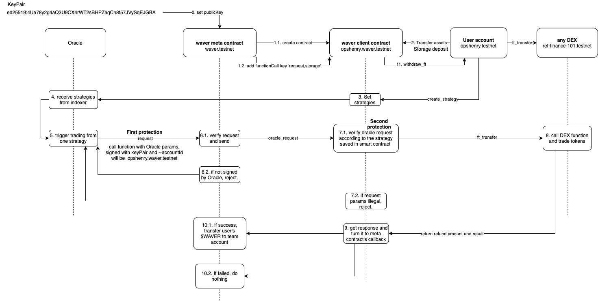

# Waver Finance

Waver Finance is the first decentralized quantitative trading platform on the NEAR protocol. 

We provide secure, transparent, intelligent, and low-cost quantitative trading services to all users.

# Project demo

[Waver Finance](https://waver.finance/)

# How it works

# Transactions Examples

Oracle request failed, slippage error:

https://explorer.testnet.near.org/transactions/5YSRp5LBSha3YBufZ4SdYiZbMVaMoNqJ9BsQyrUa5AcC

Oracle request success:

https://explorer.testnet.near.org/transactions/568LGpmQmW2VwWMFj1KNwgjVnhqbBNzQUmZSvzZgTHRG